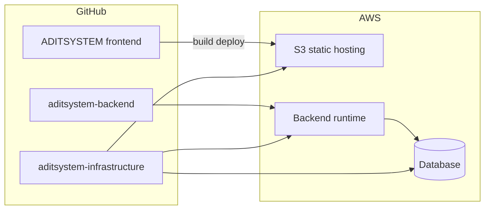

# ADITSYSTEM — Infrastructure (Terraform)

Infraestructura como código para el proyecto **ADITSYSTEM**.

## Repos relacionados

| Repo | URL |
|------|-----|
| Frontend | https://github.com/Arcoexplsoivo1/ADITSYSTEM |
| Backend | https://github.com/ervicperezdev/aditsystem-backend |

## Arquitectura prevista (MVP)



## Estructura

```
environments/
  dev/          # Entorno de desarrollo
  prod/         # Producción
modules/        # Módulos reutilizables
backend.tf      # Plantilla de remote state (S3 + DynamoDB)
versions.tf     # Providers y versión de Terraform
```

## Uso local

Por entorno (ejemplo `dev`):

```bash
cd environments/dev
terraform init
terraform fmt -check -recursive ../..
terraform validate
```

## CI/CD (GitHub Actions)

| Workflow | Cuándo | Acciones |
|----------|--------|----------|
| [terraform-ci.yml](.github/workflows/terraform-ci.yml) | PR y push a `main` | `fmt`, `validate`, `plan` |
| [terraform-apply.yml](.github/workflows/terraform-apply.yml) | Manual (`workflow_dispatch`) | `plan` + `apply` con GitHub Environment |

Documentación:

- [docs/terraform-setup.md](docs/terraform-setup.md) — bootstrap S3/DynamoDB + OIDC
- [docs/github-secrets-checklist.md](docs/github-secrets-checklist.md) — secrets y variables

Los entornos Terraform también exponen outputs para poblar el repo frontend `Westfold-Advisory/ADITSYSTEM` con:

- `AWS_ROLE_ARN`
- `AWS_REGION` (`mx-central-1` por defecto para frontend)
- `S3_BUCKET`
- `CLOUDFRONT_DISTRIBUTION_ID` opcional
- `frontend_website_url` para consultar el sitio cuando se publica con S3 Website Hosting

El nombre del bucket frontend incluye la región AWS para evitar conflictos al migrar un mismo entorno entre regiones distintas.

### Bootstrap del remote state (una vez)

```bash
cd bootstrap
cp terraform.tfvars.example terraform.tfvars
terraform init && terraform apply
```

Luego copia `config/backend-*.hcl.example` → `config/backend-*.hcl` con los valores del output.

## Convenciones

- Sin secretos en el repositorio; usar variables de entorno, GitHub Secrets o AWS Secrets Manager.
- Un archivo `*.tfvars` por entorno (no versionado; ver `.gitignore`).
- Apply a producción solo vía workflow manual + environment `production`.
