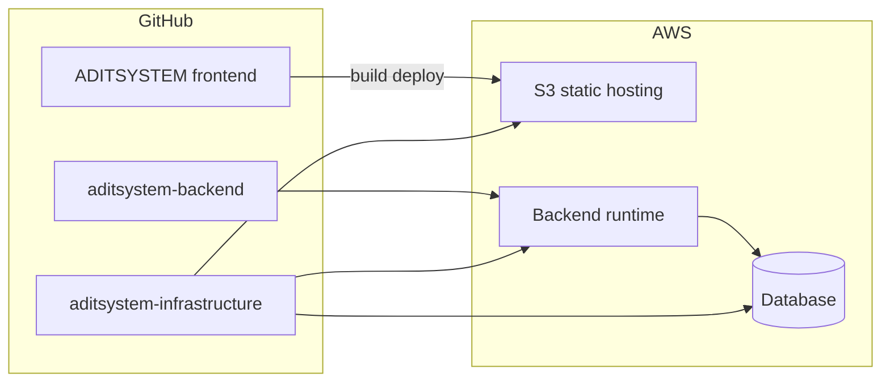

# ADITSYSTEM — Infrastructure (Terraform)

Infraestructura como código para el proyecto **ADITSYSTEM**.

## Repos relacionados

| Repo | URL |
|------|-----|
| Frontend | https://github.com/Arcoexplsoivo1/ADITSYSTEM |
| Backend | https://github.com/ervicperezdev/aditsystem-backend |

## Arquitectura prevista (MVP)



## Estructura

```
environments/
  dev/          # Entorno de desarrollo
  staging/      # Pre-producción
  prod/         # Producción
modules/        # Módulos reutilizables
backend.tf      # Plantilla de remote state (S3 + DynamoDB)
versions.tf     # Providers y versión de Terraform
```

## Uso local

Por entorno (ejemplo `dev`):

```bash
cd environments/dev
terraform init
terraform fmt -check -recursive ../..
terraform validate
```

El backend remoto en S3 está comentado en `backend.tf` hasta completar el bootstrap (TRA-47).

## Convenciones

- Sin secretos en el repositorio; usar variables de entorno, GitHub Secrets o AWS Secrets Manager.
- Un archivo `*.tfvars` por entorno (no versionado; ver `.gitignore`).
- Pipeline de CI en tarea TRA-47.
