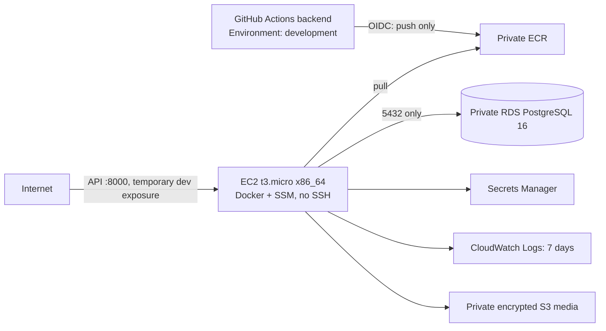

# Stack mínimo de desarrollo

`environments/dev` compone el runtime mínimo para ADITSYSTEM:



RDS es Single-AZ, cifrado con una CMK dedicada administrada por Terraform, sin acceso público y se distribuye en dos subredes privadas. El motor es PostgreSQL 16, compatible con el uso de PostGIS del backend. Tras crear la base, las migraciones deben habilitar `postgis` con el usuario administrador antes de aplicar el esquema que usa tipos geoespaciales.

No se crea NAT Gateway para desarrollo. La instancia está en una subred pública exclusivamente para obtener actualizaciones, ECR, SSM, Secrets Manager y CloudWatch a través del Internet Gateway; su grupo de seguridad no expone SSH y exige IMDSv2. RDS y S3 de medios no son públicos. El puerto 8000 queda expuesto temporalmente para el flujo público; antes de producción debe sustituirse por ALB/HTTPS y limitarse el origen.

## Entrega backend por GitHub Actions

Después de `terraform apply`, tomar estos outputs de `environments/dev` y definirlos como variables del GitHub Environment `development` en `Westfold-Advisory/aditsystem-backend`:

| Variable | Output |
|---|---|
| `AWS_REGION` | `backend_github_variables.AWS_REGION` |
| `AWS_ECR_REPOSITORY` | `backend_ecr_repository` |
| `AWS_DEPLOY_ROLE_ARN` | `backend_github_deploy_role_arn` |
| `AWS_EC2_INSTANCE_ID` | `backend_instance_id` |
| `AWS_RUNTIME_SECRET_ARN` | `backend_runtime_secret_arn` |
| `AWS_DB_SECRET_ARN` | `database_master_secret_arn` |

El trust policy exige exactamente `repo:Westfold-Advisory/aditsystem-backend:environment:development`. El rol sólo puede obtener un token ECR y subir capas/manifiestos al repositorio creado; no puede administrar EC2, secretos ni otros repositorios. No se usan access keys persistentes.

## Secretos y operación

RDS administra la contraseña maestra en Secrets Manager mediante `manage_master_user_password`; su ARN se entrega como output sensible. El secret `${project}-${environment}/backend-runtime` se crea vacío para que las claves JWT y la lista CORS se carguen fuera de Git y del estado Terraform. Nunca registrar su contenido en logs ni variables públicas del frontend.

La EC2 incluye Docker y un instance profile con SSM, lectura del secret runtime y de la contraseña RDS, lectura del ECR propio y escritura únicamente al log group del backend. El rol OIDC del backend puede publicar únicamente en ECR y ejecutar `AWS-RunShellScript` exclusivamente en esta EC2; no puede administrar EC2 ni leer secretos. El despliegue del contenedor y las migraciones se ejecutarán por SSM usando una etiqueta inmutable publicada por el pipeline backend; no se requiere ni se habilita SSH.

### Poblar `backend-runtime` (paso manual único por ambiente)

`scripts/deploy-ec2.sh` en `aditsystem-backend` lee este secret en cada despliegue y falla el deploy si faltan `jwt_private_key` o `jwt_public_key` — por diseño, ni el pipeline ni la instancia EC2 generan el par de llaves por sí mismos. Generarlas automáticamente ahí rotaría las llaves en cada despliegue (invalidando todos los tokens vigentes) o forzaría a guardar el secreto en GitHub Actions/Terraform, ambos prohibidos por las reglas de seguridad del proyecto. Por eso este es un paso manual, ejecutado una sola vez por ambiente (y de nuevo solo si se decide rotar las llaves) por quien tenga acceso a Secrets Manager:

```bash
# 1. Generar el par RS256 (no versionar, no dejar en disco tras el paso 2)
openssl genpkey -algorithm RSA -pkeyopt rsa_keygen_bits:2048 -out /tmp/jwt-private.pem
openssl rsa -pubout -in /tmp/jwt-private.pem -out /tmp/jwt-public.pem

# 2. Obtener el ARN del secret (output de environments/dev)
SECRET_ARN=$(terraform -chdir=environments/dev output -raw backend_runtime_secret_arn)

# 3. Cargar el contenido runtime completo que espera scripts/deploy-ec2.sh
python3 - "$SECRET_ARN" <<'PY'
import json, subprocess, sys
secret_arn = sys.argv[1]
payload = {
    "jwt_private_key": open("/tmp/jwt-private.pem").read(),
    "jwt_public_key": open("/tmp/jwt-public.pem").read(),
    "cors_allowed_origins": "https://<dominio-frontend-dev>",
    "database_name": "aditsystem",
}
subprocess.run(
    ["aws", "secretsmanager", "put-secret-value", "--secret-id", secret_arn,
     "--secret-string", json.dumps(payload)],
    check=True,
)
PY

# 4. Borrar las llaves del disco local
rm -f /tmp/jwt-private.pem /tmp/jwt-public.pem
```

Tras cargar el secret, el siguiente `push` a `main` de `aditsystem-backend` (o un re-run manual del job `deploy`) recoge las llaves en el próximo `scripts/deploy-ec2.sh` sin cambios adicionales en el pipeline ni en la EC2.

Las opciones `enable_alb`, `enable_cloudfront`, `enable_waf`, `enable_custom_dns` y `enable_multi_az` existen con valor `false` por defecto. No crean recursos adicionales hasta que se diseñen esos componentes.
